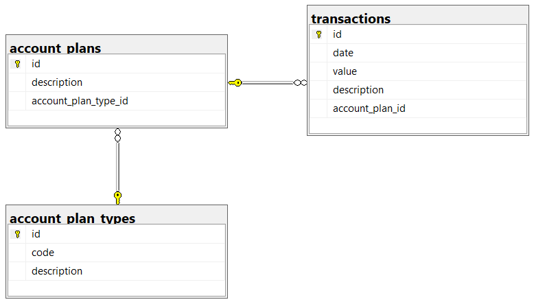
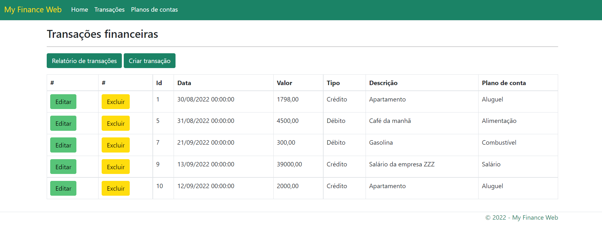
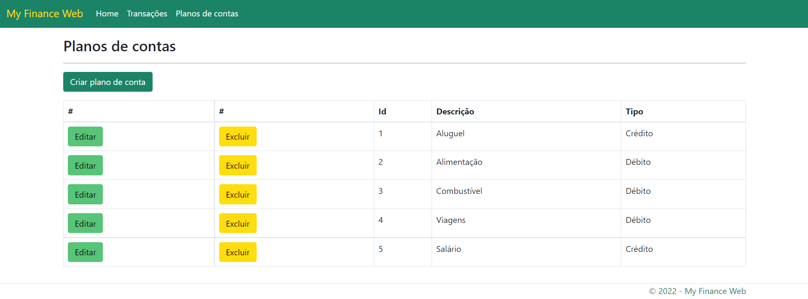

# myfinance-web-netcore

*Projeto do Curso de Pós-Graduação em Engenharia de Software da PUC-MG. Trata-se de um sistema para controle de finanças pessoais.*

## Banco de dados

A imagem abaixo representa a modelagem lógica do banco de dados do sistema.



Na modelagem do banco de dados há três tabelas: account_plans, transactions e account_plan_types.

- **account_plan_type**: tabela que armazena os tipos permitidos para um plano de conta: crédito ou débito.
- **account_plans**: tabela que armazena os planos de conta, que têm um tipo e uma descrição
- **transactions**: tabela que armazena as transações, que envolvem algum plano de conta e têm data, valor e descrição.

O script para a criação do banco de dados está no arquivo [my_finance.sql](docs/my_finance.sql).

## Arquitetura

O projeto foi desenvolvido seguindo o padrão MVC, que divide a aplicação em três camadas: Model, View e Controller.

## Ferramentas utilizadas

No desenvolvimento do projeto, foram usadas as seguintes ferramentas:

- Windows 11 Home Single Language
- Git 2.37.1
- Visual Studio Code 1.71.0
- SQL Server 2019
- .NET 6
- Bootstrap 5

No projeto foi adicionado o pacote Nuget SqlClient 4.8.3.

No Visual Studio Code foi instalada a extensão C# for Visual Studio Code (powered by OmniSharp).

## Execução do projeto

Para executar o projeto, seguir os seguintes passos:

 - Clonar o [projeto](https://github.com/felipecr/myfinance-web-netcore.git).
- Executar no SQL Server o [script para criação das tabelas e inserção de linhas](docs/my_finance.sql).
- Abrir a [pasta do projeto](myfinance-web-netcore) no Visual Studio Code.
- No terminal do Visual Studio Code, executar os comandos apropriados para fazer o build ou rodar o projeto:

```
dotnet build
dotnet run
```

## Telas

A seguir são apresentadas algumas telas do projeto em execução no navegador Microsoft Edge.

### Transações financeiras



### Planos de contas


## Nota

Este projeto foi desenvolvido para a disciplina Práticas de Implementação e Evolução de Software do curso de Engenharia de Software da PUC Minas. Muitas melhorias e atualizações ainda podem ser adicionadas ao projeto.